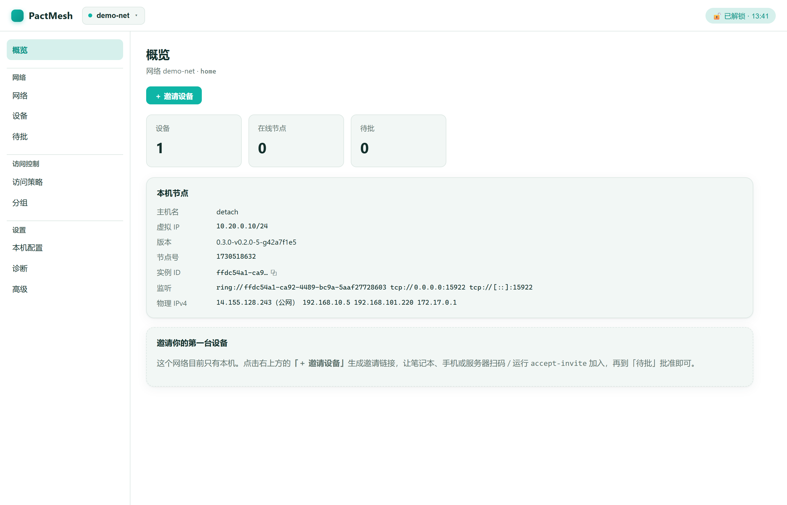
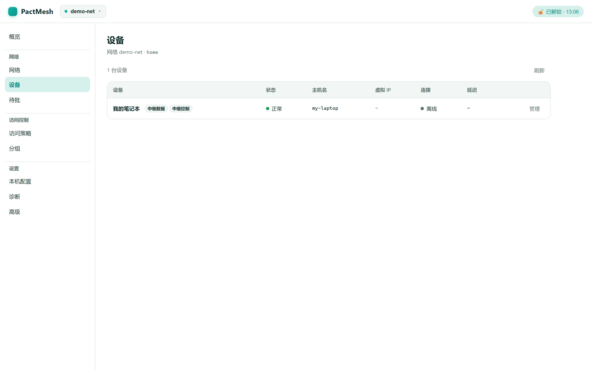
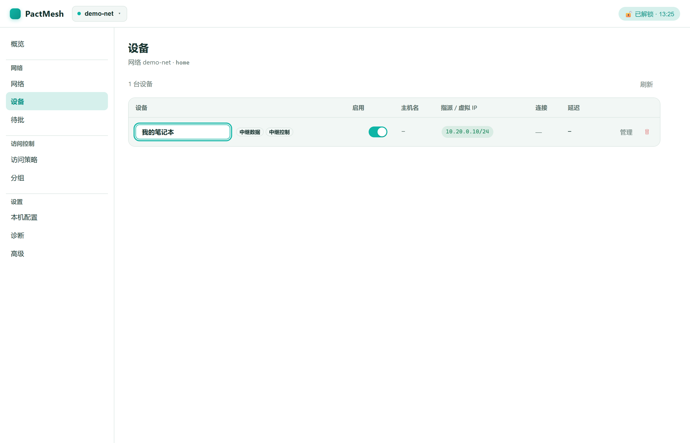
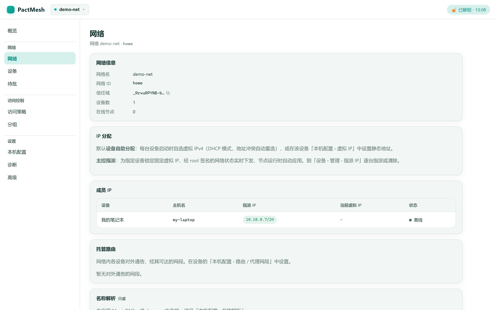
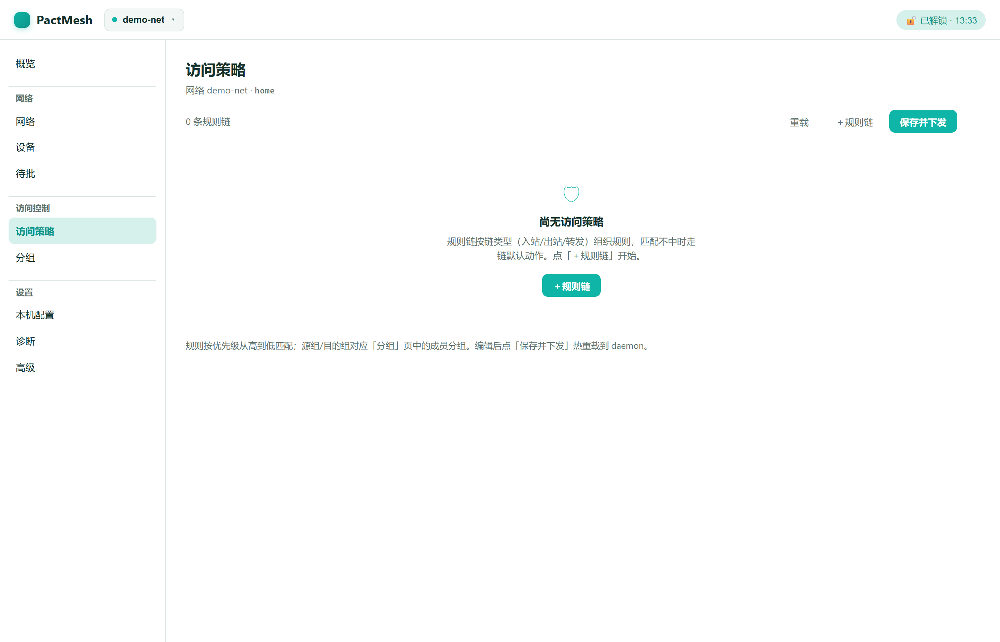
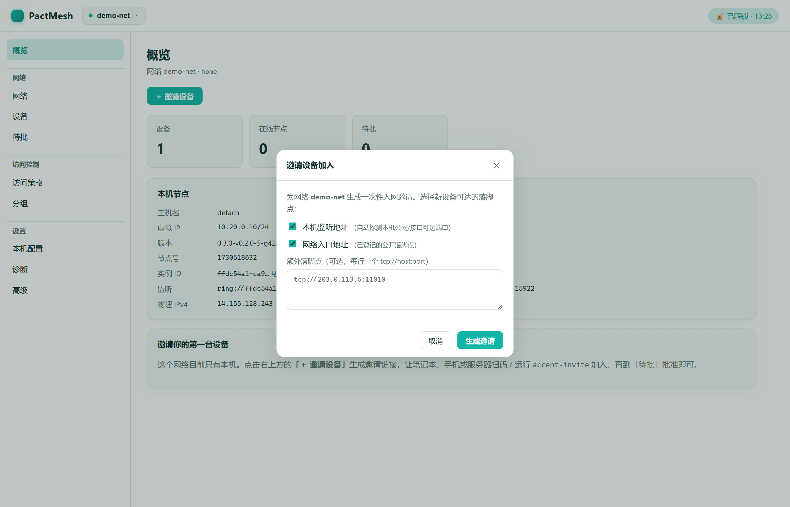

# PactMesh

**English** | [中文](README.md)

PactMesh is the product name for this EasyTier fork. It keeps EasyTier's decentralized data plane and adds a signed trust/configuration layer for small private networks.

This repository is based on EasyTier commit `5a1668c` (2026-04-25). EasyTier provides the P2P transport, NAT traversal, routing, tunnels, and RPC substrate; PactMesh adds self-managed trust domains, member certificates, signed network configuration, ACLs, MagicDNS host rendering, and cross-trust-domain relay borrowing.

The user-facing CLI and daemon binaries are now named `pactmesh` and `pactmesh-core`. The local config path still uses `~/.config/privateNetwork` for compatibility with the existing Alpha data layout.

In one line: **the data plane (EasyTier) does everything it can to connect devices directly across hostile NATs, falling back to relays when it cannot; the governance plane (PactMesh) lets your own keys decide who may join, what they may do, and whose relays to borrow — all verified locally, with no central server.**

## Status

PactMesh is currently Alpha software for private and small-team use. A VPS + NAT device + online join + TUN path has been validated, but this is not yet a polished end-user product, an enterprise IAM product, a hosted control plane, or a multi-tenant SaaS system.

The core implementation is currently focused on:

- Trust domains rooted in an Ed25519 `PK_root` / `SK_root` pair.
- Signed `NetworkState` and `TrustDomainMeta` objects distributed over untrusted channels.
- Member certificates for device admission, revocation, disable/enable, and hostname assignment.
- Trust-aware EasyTier handshakes and packet ACL enforcement.
- Bootstrap invite/import flows for moving public trust-domain information between devices.

## Feature Overview

The data plane is inherited from EasyTier; the trust/governance plane is PactMesh's addition. The two are orthogonal: **role ≠ capability, permanent revocation ≠ temporary disable, and the configuration distribution channel does not need to be trusted.** The tables below are the full capability list; the conceptual notes on the trust model and relay borrowing follow in later sections.

### Networking Data Plane

Connects directly across hostile NATs whenever possible, falling back to relays.

**Connections and tunnels**

| Feature | Notes / rationale |
| --- | --- |
| Virtual NIC (TUN) | Devices talk over virtual overlay IPs as if on one LAN |
| No-TUN mode (`no_tun`) | No virtual NIC, only port forwarding / proxy. Lets routers, restricted containers, and no-TUN-permission environments join as forwarders |
| Multi-protocol transport (`default_protocol`) | One connection over TCP / UDP / WebSocket (ws, wss) / QUIC. On a network that allows only 443, use wss to look like HTTPS |
| User-space TCP stack (`use_smoltcp`) | Independent of the host stack; for restricted/embedded environments |
| MTU configuration (`mtu`) | Adapt to the link, avoid fragmentation |

**NAT traversal (hole punching)**

| Feature | Notes / rationale |
| --- | --- |
| UDP / TCP / symmetric-NAT hole punching | Three independent toggles (`disable_udp/tcp/sym_hole_punching`) for per-NAT-type isolation when debugging |
| UPnP automatic port mapping | Opens a port proactively when the router supports it (`disable_upnp` to turn off) |
| Hole-punch assistance (`can_assist_holepunch`) | A node with a public address brokers between two blocked peers |
| Bind to a physical NIC | `bind_device` / `bind_device_public` / `bind_device_name` force a chosen NIC; avoids contamination when a proxy TUN has hijacked the default route |

**Relay (fallback)**

| Feature | Notes / rationale |
| --- | --- |
| Relay forwarding | Auto-relays through a public node when direct fails, so the link never drops |
| Relay whitelist (`relay_network_whitelist`) | Restrict which networks may be relayed |
| Relay all peer RPC (`relay_all_peer_rpc`) | Control signaling forwarding scope |
| Foreign-relay rate limit (`foreign_relay_bps_limit`) | Separately caps relay traffic you lend out, so foreign forwarding cannot saturate your bandwidth |

**Transport optimization and security**

| Feature | Notes |
| --- | --- |
| Encryption (`enable_encryption` / `encryption_algorithm`) | On/off plus algorithm choice (AES-GCM, ChaCha20, etc.) |
| Data compression (`data_compress_algo`) | e.g. zstd; saves bandwidth on weak links |
| KCP proxy acceleration (`enable_kcp_proxy`) | TCP over KCP for loss resilience; tune with `disable_kcp_input` / `disable_relay_kcp` |
| QUIC proxy (`enable_quic_proxy`) | Tune with `disable_quic_input` / `disable_relay_quic` |
| Foreign-relay KCP/QUIC | `enable_relay_foreign_network_kcp` / `_quic` control whether a lent relay carries the accelerated protocols |
| Latency-first routing (`latency_first`) | Pick the lowest-latency path when several exist |
| Receive rate limit (`instance_recv_bps_limit`) | Instance-level bandwidth cap |
| Multi-threading (`multi_thread` / `multi_thread_count`) | Saturate multiple cores for throughput |
| Private mode (`private_mode`) | Restrict the node from relaying/exposing freely |

**Network services**

| Feature | Notes / scenario |
| --- | --- |
| Exit node (`enable_exit_node`) | Route all traffic out through one device; from abroad, egress through your home node as if you were home |
| Subnet proxy / route sharing | Expose a device's whole LAN subnet (e.g. a NAS subnet) to members without installing a client on every box |
| WireGuard portal (VpnPortal) | A standard WireGuard entry point for devices that cannot run PactMesh (old phones, TV boxes) |
| MagicDNS (`accept_dns` / `tld_dns_zone`) | Use hostnames (e.g. `nas.home`) instead of memorizing IPs |

### Daemon Management (CLI)

| Command | Function |
| --- | --- |
| `peer list` / `list-foreign` / `list-global-foreign` | Local / specific-foreign / all cross-domain peers |
| `route list` / `route dump` | View / export the routing table |
| `connector add` / `remove` / `list` | Add or remove connection entry URLs |
| `mapped-listener add` / `remove` / `list` | Manage mapped listener addresses |
| `stun` | Test the local NAT type (hole-punch debugging) |
| `vpn-portal` | Show WireGuard portal info |
| `node info` / `node config` | Self core status and configuration |
| `proxy` | TCP/KCP proxy status |
| `acl stats` | ACL rule hit statistics |
| `port-forward add` / `remove` / `list` | Port forwarding (map a remote service to a local port) |
| `whitelist set-tcp` / `set-udp` / `clear-tcp` / `clear-udp` / `show` | TCP/UDP port whitelist |
| `stats show` / `stats prometheus` | Runtime statistics; export Prometheus format for Grafana |
| `logger get` / `set` | Adjust log level at runtime, no restart |
| `service install` / `uninstall` / `status` / `start` / `stop` / `restart` | Register as a system service, auto-start on boot |
| `tui` | Interactive terminal console (ratatui, with Node / Peers / Joins approval) |
| `gen-autocomplete` | Generate shell completion scripts |

### Trust and Governance (`trust`)

Each user owns a trust domain, signing certificates and configuration with a root key (Ed25519 `SK_root`), with no central authority. See [Trust Model](#trust-model) for the concepts.

| Command | Function / rationale |
| --- | --- |
| `create-domain` / `list-domains` | Create a trust domain (generates the root key, sets the management password, stores the root key encrypted as `sk_root.age`) / list local domains |
| `create-network` | Create a concrete network inside a domain |
| `bootstrap-self` | Issue the root device its own member certificate |
| `invite` / `accept-invite` | Issue / accept an invite via URL, file, or QR; configuration is signed, so any distribution channel is safe |
| `approve` / `reject` / `list-pending` | Online admission approval |
| `revoke` | Permanently revoke a device, requiring a reason (key compromise / device lost / removed / superseded / unspecified), signed into the certificate for audit |
| `disable` / `enable` | Temporarily disable / re-enable a device, distinct from permanent `revoke`; re-enabling needs no re-issuance |
| `upgrade-peer-to-root` | Promote a member device to root; the raw root key travels over the encrypted peer channel, and the target's unlock password is entered only locally. For authority migration / multiple roots |
| `list-members` / `list-external` | Member / external-referenced device lists |
| `show-device` / `rename-device` | Inspect / rename a device |
| `set-hostname` / `unset-hostname` | Assign a hostname, used with MagicDNS for name-based access |
| `capability set` | Set capability bits (`can_relay_data`, `can_assist_holepunch`); role and capability are separate, so a member can be authorized as a relay |
| `tag list` / `add` / `remove` | Human grouping labels (e.g. home / work) |
| `peer-hint list` / `add` / `remove` | Manually provide a node's address hint to aid connection / hole punching |
| `acl explain` | Explain current ACL traffic rules (who may reach whom) |

### Credentials and Bootstrap Distribution

| Command | Function / scenario |
| --- | --- |
| `credential generate` / `revoke` / `list` | Issue / revoke / list temporary credentials; hand a short, auto-expiring join credential to a temporary collaborator |
| `bootstrap export` / `import` | Export / import a trust-domain bootstrap bundle for offline distribution of public trust-domain info |

### Local Web Controller (`controller`)

A product-grade browser admin console on par with ZeroTier / Tailscale — light, clean, teal connection-themed visuals. The frontend is built with Preact + Vite into a **single file**, then embedded into the pure-Rust binary via `include_str!` — zero Node and zero external deps at runtime, single binary intact. It runs on the CLI side and connects to the locally running daemon RPC:

```bash
pactmesh --rpc-portal 127.0.0.1:<rpc> controller --listen 127.0.0.1:15810
# Prints a local URL carrying a one-shot token; loopback-only access
```

**Screenshots**

<table>
  <tr>
    <td><br><sub>Overview · health metrics + invite CTA</sub></td>
    <td><br><sub>Devices · fused identity + runtime table</sub></td>
  </tr>
  <tr>
    <td><br><sub>Device drawer · root-assigned fixed virtual IP</sub></td>
    <td><br><sub>Network · member IPs / managed routes / DNS</sub></td>
  </tr>
  <tr>
    <td><br><sub>Access policy · visual ACL editor</sub></td>
    <td><br><sub>Invite device · QR code + usage</sub></td>
  </tr>
</table>

- **Read-only dashboards**: node / peers / routes / stats / connectors / mapped listeners / port forwards / VPN portal / ACL stats & conn-track / whitelist / credentials (refreshed every 2s).
- **Config push** (daemon RPC, hot-reload, no root passphrase): connectors / mapped listeners / port forwards / routes / proxy networks / exit nodes / cross-domain relay grants / hostname / IPv4 / whitelist, plus a form-based **ACL editor**.
- **Member governance** (root-signed, requires unlock): approve / reject joins, revoke / disable / enable, rename / hostname / capability, ACL tags, peer-hints.
- **Bootstrap & high-risk governance**: create-domain (mints a new management passphrase), create-network, upgrade peer to root, arm local root-upgrade acceptance, export invite. High-risk actions (create-domain / upgrade-root) require a second confirmation in the UI.
- **Security**: loopback-bind only; every request validates a token (Cookie `SameSite=Strict` / Bearer); the root passphrase is cached in controller memory via "unlock" with `zeroize` and a TTL that auto-clears, never persisted or logged; inline passphrases for create-domain / create-network are used-then-zeroized. Device self-enrollment (`bootstrap-self`) remains a one-time CLI step.

The **Devices** view fuses identity and runtime into one table — the member roster is left-joined to live routes / peers by hostname, so a single row shows online status, overlay IPv4/IPv6, direct/relay path + tunnel type, and latency. The management drawer adds physical IPs (`ip_list`, public / interface v4·v6), per-connection remote addresses, and a read-only MagicDNS FQDN.

### Test and Operations Scaffolding (`lab`)

Primarily for development and regression testing, not an end-user daily feature: `doctor` (environment check), `status` (summarize local files / RPC / peers / logs), `run`, `approve`, `peers explain/root/joiner`, `remote-check`, `remote-run` / `remote-fresh-run` (SSH-driven three-node regression; the latter runs from a fresh trust domain), `commands`, `disable` / `enable`. `wizard` and the old no-TTY fallback are deprecated in favor of `tui`.

## Trust Model

Each user owns a trust domain. A trust domain is identified by `trust_domain_id = SHA-256(PK_root)`, and the holder of `SK_root` signs all member certificates and network configuration for that domain.

The user-facing management password is the root key passphrase for the local `sk_root.age` file. It is not an account password, login password, or mnemonic recovery phrase. Recovering management authority requires both the `sk_root.age` backup and the root key passphrase; either one alone is insufficient.

Configuration distribution does not need to be trusted. Nodes verify signatures locally before accepting a `NetworkState`, `TrustDomainMeta`, member certificate, or join-related payload. This keeps the network usable over ordinary EasyTier paths, relays, files, QR/bootstrap payloads, or future sync channels without giving those channels authority.

Device roles are governance identities, not feature toggles: a Root device can unlock this trust domain's `SK_root`, a Member device has this domain's `member_cert.pem`, and an External device is referenced by this domain without being a member. Network functions such as relay, holepunch assistance, and subnet proxying are capabilities. Tags are human grouping labels. ACLs only decide data-plane traffic permission.

To make another already-joined member device a Root device, start the target daemon with a temporary local `PNW_ROOT_UPGRADE_PASSPHRASE` value, then run `pactmesh trust upgrade-peer-to-root <trust_domain_id> <network_local_id> <peer_id>` on an existing Root device. The existing Root device unlocks its local `sk_root.age`, sends raw `SK_root` bytes through the established peer RPC/Noise path, and the target verifies the derived `PK_root` against its cached `pk_root.pem` before writing its own encrypted `sk_root.age`. The target passphrase is never sent from the existing Root device; it must be supplied locally on the target side.

## Cross-Trust-Domain Relay Borrowing

A small-team trust domain often has only a handful of nodes, none of which sit on a stable public address. PactMesh lets one trust domain explicitly lend its relays to another, without merging the two domains or sharing private keys.

The mechanism layers on top of `TrustDomainMeta`:

- A trust domain's `TrustDomainMeta.active_relays` list, signed by `SK_root`, enumerates the relays the domain operates.
- `TrustDomainMeta.outbound_grants` lists explicit, time-bounded grants of those relays to foreign trust domains (identified by `foreign_root_pk` + `foreign_trust_domain_id`).
- A borrowing node attaches a `BorrowedRelayProof` — built from the lender's signed `TrustDomainMeta` slice — to the relevant handshake messages. The relay verifies the proof locally against its own resolver, with no central authority involved.
- Capabilities (`can_relay_data`, `can_assist_holepunch`) and expiry are signed into each grant, so capacity, lifetime, and scope are all owned by the lending domain's root.

This makes asymmetric topologies practical: a friend with a well-connected home server can lend relay capacity to your domain for a few months, expiry signed in, with no shared secrets and no joint operations.

## One-line Install

Prebuilt binaries ship via GitHub Releases (triggered by `v*` tags, covering **Windows x86_64** and **Linux x86_64**). The installer downloads the binaries, puts them on PATH, and on Linux grants `cap_net_admin,cap_net_raw` to `pactmesh-core` so the daemon runs without sudo.

```bash
# Linux x86_64 (needs root; optional --gh-proxy for restricted regions)
curl -fsSL https://github.com/Detachment-x/PactMesh/releases/latest/download/install.sh | sudo bash
```

```powershell
# Windows x86_64 (Administrator PowerShell)
irm https://github.com/Detachment-x/PactMesh/releases/latest/download/install.ps1 | iex
```

> Windows also ships an **offline installer** `pactmesh-setup-x86_64.exe` (a Release asset — just double-click): it drops the binaries and drivers, adds them to PATH, creates "PactMesh Console" Start-menu/desktop shortcuts, and can optionally register the boot auto-start service (run `pactmesh quickstart` first so the service can self-unseal).

Then a **single command** performs first-run setup (create trust domain → create network → bootstrap this device → start the daemon → open the local web console):

```bash
pactmesh quickstart
# prints http://127.0.0.1:15810/?token=... — open it in your browser
```

`quickstart` prompts for the management and device-key passwords on a TTY; for automation/non-TTY use `--passphrase-file` / `--device-passphrase-file` or the `PNW_ROOT_PASSPHRASE` / `PNW_DEVICE_PASSPHRASE` env vars. Ports and names are configurable, e.g. `pactmesh quickstart --network-id home --listen 127.0.0.1:15810`.

> To build from source or run the manual step-by-step setup (to understand each step), see Quick Start and Build & Test below.

## Quick Start

> The steps below are the manual equivalent of `pactmesh quickstart`, useful for understanding the trust model; for day-to-day first-run setup just use `pactmesh quickstart` above.

The exact binary name and service wrapper depend on how you build or package this fork. For first-run setup, use this order: create a trust domain and set the management password, create a network, bootstrap the root device as a member, then export an invite for other devices.

```bash
# 1. Create a trust domain. Enter and confirm the management password interactively;
#    the root private key is encrypted locally as sk_root.age.
pactmesh trust create-domain --label home --out-dir ~/.config/privateNetwork/trust-domains

# Save the trust_domain_id printed by create-domain.
export TRUST_DOMAIN_ID='<trust_domain_id>'
export NETWORK_LOCAL_ID='home'

# 2. Create a network inside that trust domain.
pactmesh trust create-network "$TRUST_DOMAIN_ID" "$NETWORK_LOCAL_ID" --default-action accept

# 3. Bootstrap the current root device as a network member.
pactmesh trust bootstrap-self "$TRUST_DOMAIN_ID" "$NETWORK_LOCAL_ID" --device-label root-a

# 4. Export an invite/bootstrap bundle for another device.
pactmesh trust invite "$TRUST_DOMAIN_ID" "$NETWORK_LOCAL_ID" \
  --seed tcp://<reachable-node>:11010 \
  --format url

# 5. On the new device, accept the invite and generate a join request.
pactmesh trust accept-invite '<privatenetwork://join?...>' \
  --device-label laptop \
  --hint 'Alice laptop'
```

Automation and non-TTY environments cannot use the interactive prompt; provide the management password through `PNW_ROOT_PASSPHRASE` or `--passphrase-file` instead. The management password is only needed by management CLI commands that sign with `SK_root`, such as `create-domain`, `create-network`, `bootstrap-self`, `approve`, and `revoke`. Do not keep it in the daemon environment.

Online approval is the default (the root side must run a daemon/instance with trust services enabled): `trust accept-invite` derives a join-admission endpoint from the invite's `tcp://<reachable-node>:11010` seed as `tcp://<reachable-node>:11011`, so public firewalls must allow `11010/TCP` and `11011/TCP`; the management RPC port `15888` should remain bound to localhost and must not be exposed to new devices or the public Internet. By default the device private key is stored as `sk_self.raw` with local file permissions, so the daemon can restart without an interactive device passphrase; if you set `PNW_DEVICE_PASSPHRASE` or use `--passphrase-file`, PactMesh stores `sk_self.age` instead and the daemon reads `PNW_DEVICE_PASSPHRASE` by default; pass `--sk-self-password-env` only when using a different environment variable name. Keep the root key passphrase out of the daemon environment, and let management CLI commands unlock `SK_root` only when signing approvals or config changes. For air-gapped or manual approval, add `--offline`: the command only prepares local device keys and a pending join request artifact without any network access, to be submitted later by hand.

`pactmesh-core --daemon` means “run the network instance in daemon mode”; it does not fork itself into the background. For manual testing, run it under `nohup ... &`, `systemd`, `screen`, or `tmux`, and redirect logs explicitly.

## Build And Test

Rust 1.95 is the project baseline.

```bash
cargo build -p pactmesh
cargo test --test trust
cargo clippy -- -D warnings
```

Some integration and e2e tests exercise EasyTier tunnel behavior and may need Linux networking capabilities depending on the selected test target.

## Release Binaries

PactMesh builds two release binaries: `pactmesh-core` for the daemon and `pactmesh` for the management CLI.

Build release binaries from the workspace:

```bash
cd workspace/pactmesh
cargo build --release --bin pactmesh-core --bin pactmesh
```

The artifacts are written to the workspace target directory, not the crate directory:

```text
workspace/target/release/pactmesh-core
workspace/target/release/pactmesh
```

On the current Linux x86-64 build machine, the release artifacts are dynamically linked ELF x86-64 binaries. The observed sizes are about `28M` for `pactmesh-core` and `14M` for `pactmesh`. These x86-64 binaries cannot run directly on ARM hosts; build on the ARM host or add a proper Rust target/toolchain and cross-linker before distributing to ARM.

Copy both binaries to a test server, for example:

```bash
scp workspace/target/release/pactmesh-core workspace/target/release/pactmesh user@server:/opt/pactmesh/
ssh user@server 'chmod +x /opt/pactmesh/pactmesh-core /opt/pactmesh/pactmesh'
```

## Design Documents

- [Deployment guide](deploy.md) (Chinese: [deploy_CN.md](deploy_CN.md))
- [Temporary credential system plan](pactmesh/docs/credential_peer.md)
- [PeerConn Secure Mode (out-of-order tunnel friendly)](pactmesh/docs/peer_conn_secure_mode_v3.md)
- [Relay peer manager design](pactmesh/docs/relay_peer_manager_design.md)
- [Third-party notices](THIRD_PARTY_NOTICES.md)

## Relationship To EasyTier

PactMesh is a fork, not a replacement for the upstream EasyTier project. The fork keeps EasyTier's core networking architecture and changes the governance layer from shared network secrets toward explicit trust domains and signed configuration.

Upstream EasyTier remains the origin of the transport and routing stack. See the original project at <https://github.com/EasyTier/EasyTier>.

## License

This fork is distributed under LGPL-3.0-or-later, consistent with EasyTier's LGPL licensing. See `LICENSE` and `THIRD_PARTY_NOTICES.md` for license and provenance details.
